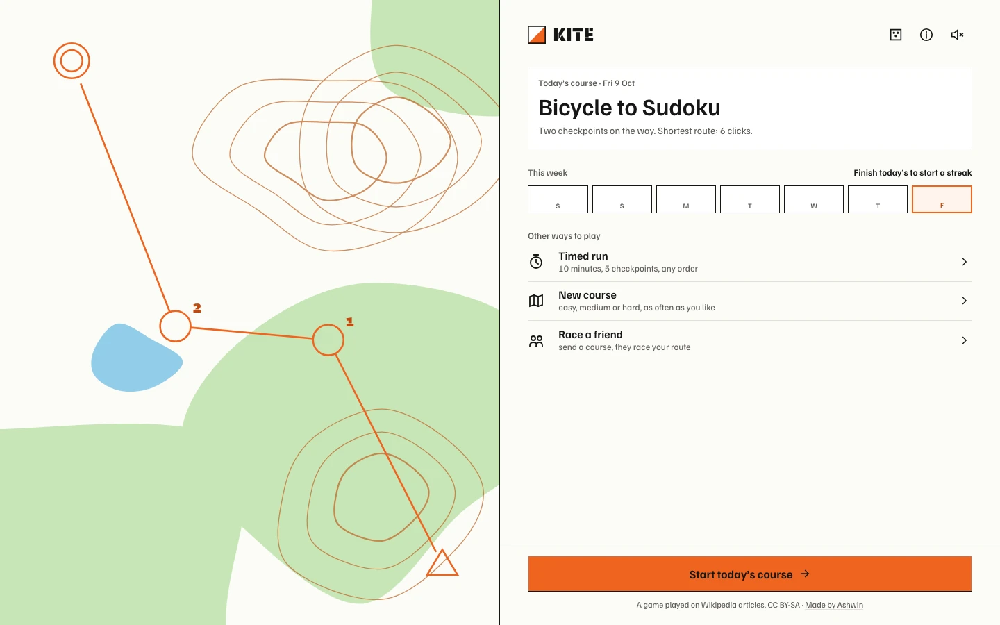
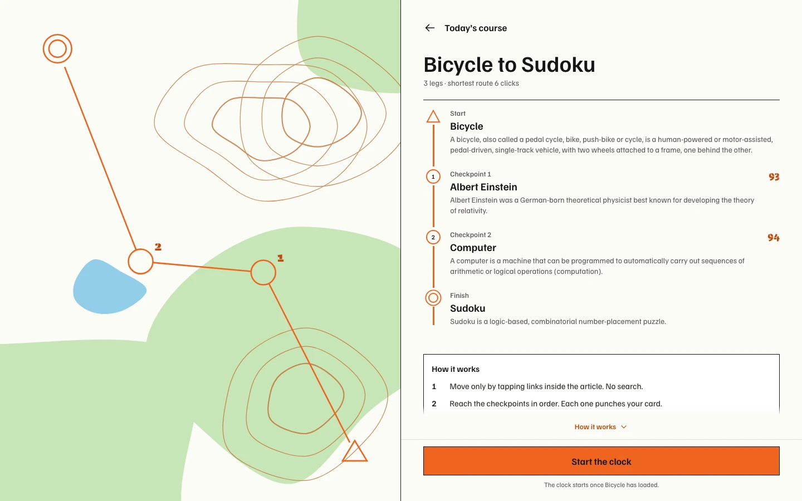
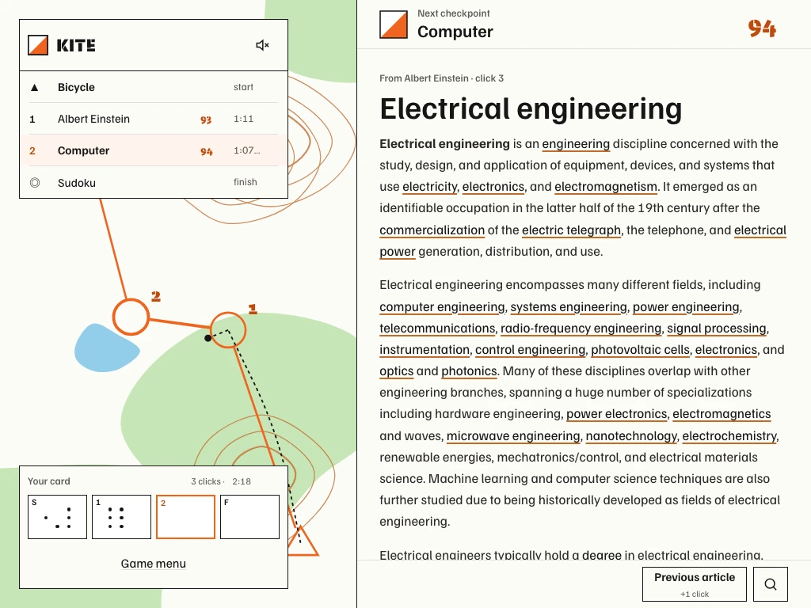
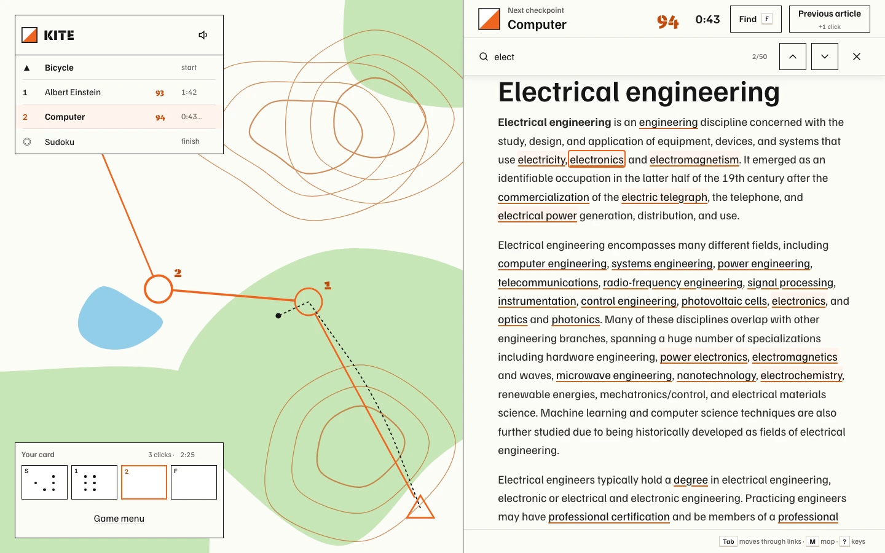
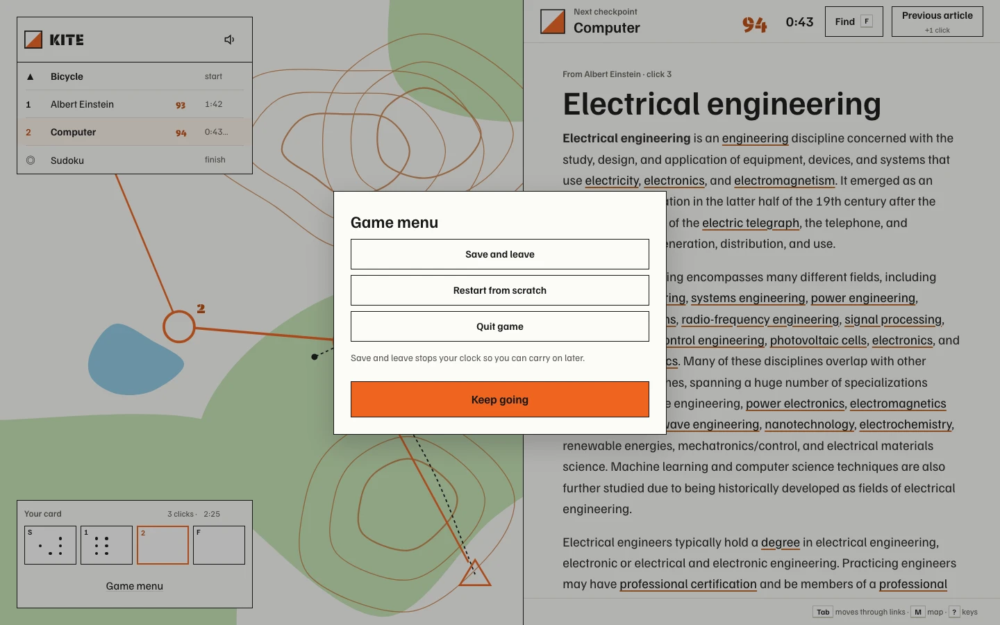
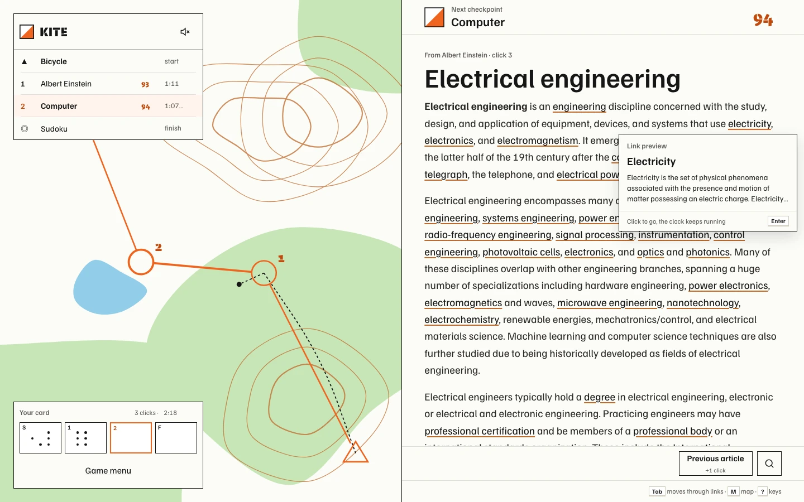

<p align="center">
  <a href="https://kite.ashwin.co.in">
    
  </a>
</p>

<p align="center">
  <a href="https://kite.ashwin.co.in"><strong>kite.ashwin.co.in</strong></a>
  &nbsp;·&nbsp;
  <a href="#what-it-does">what it does</a>
  &nbsp;·&nbsp;
  <a href="#the-design">the design</a>
  &nbsp;·&nbsp;
  <a href="#running-it">running it</a>
</p>

<br>

the source of **[kite.ashwin.co.in](https://kite.ashwin.co.in)**, a race through wikipedia. get from the start article to the finish through two checkpoints, using only the links inside each article. fewest clicks wins, the clock breaks ties.

it borrows from orienteering, where you run a course from checkpoint to checkpoint with a map and a card you punch at each one.

the screenshots show the current desktop, tablet and phone layouts with sample progress and real wikipedia articles.

## what it does

<p align="center">
  
  &nbsp;
  
  &nbsp;
  
</p>

- **today's course.** everyone gets the same course each day: a start, two checkpoints and a finish. each one is a wikipedia article.
- **links only.** you move by tapping links inside the article. no article search, no infobox, no see also. **previous article** steps back and adds one click.
- **your card.** every checkpoint punches its own pin pattern into your card, made from the article's title. the clock pauses while you read your leg time.
- **the shortest route.** every leg comes with the fewest clicks it can be done in. after you finish, you see your route beside it, leg by leg.
- **link preview.** long press a link, or hover it on a computer, to read a short summary before you go. desktop previews fit above or below the link without covering it, and disappear when you move away or scroll. the clock keeps running.
- **find a link.** press `F` or tap find to match links in the current article. matching waits until you pause typing, so partial words don't send the page scrolling. up and down arrows move through the matches; plain text isn't counted. tapping find again closes it.
- **game menu.** save and leave stops the clock and keeps your progress. restart from scratch returns to the first article with zero clicks and a fresh clock; quit game discards the run and returns home. restart and quit ask first, and your finished cards stay saved.
- **timed run.** ten minutes, five checkpoints, any order. get as many as you can.
- **new course.** easy, medium or hard, as often as you like.
- **race a friend.** your card goes out as a link. they get the same course, with your clicks and leg times to beat.
- **streak and history.** a week of punched boxes on the home screen, and every finished card kept on your device.
- **share.** the result pastes as three short lines, like a daily puzzle.

### keys

| key | does |
| --- | --- |
| `Tab`, `Enter` | move through the links, go to one |
| `F` | open or focus find in the current article |
| `↑`, `↓` | previous or next match while using find |
| `Enter`, `Shift+Enter` | next or previous match while typing in find |
| `⌫` | previous article, adds one click |
| `M` | open the map |
| `S` | sound on or off |
| `?` | all the keys |
| `Esc` | close |

## how the courses are made

a course is only fair if the shortest route is real. `scripts/courses.ts` builds them ahead of time and writes `src/data/courses.json`.

- it picks articles from a pool of 180 that most people know (tea, black hole, chennai, ada lovelace, origami).
- for each leg it works out the true shortest number of clicks, using the same rules the game uses for which links count. both sides share `src/lib/links.ts`, so a link the script counts is always a link you can tap.
- one click is checked straight from the article. two clicks are checked against wikipedia's link table for every link on the page, then confirmed on the real article. if neither works, it searches for a three click route. finding one proves the shortest is three.
- legs that need one click, or more than three, are thrown out. every course lands between 6 and 9 clicks: 6 is easy, 7 is medium, 8 or more is hard.
- requests go out at about three a second with a named user agent, and every page is cached, so a rerun only asks wikipedia for what it hasn't seen.

the day's course is picked by date, so everyone gets the same one with no server.

## how a click works

- articles come from wikipedia's page html api, called from your browser with an `Api-User-Agent` header. a browser gets 200 requests a minute and a round uses about one per click.
- the article is cleaned of navboxes, infoboxes, references, hatnotes, images and the end sections, then sanitised with dompurify. what's left is the text and its links.
- a checkpoint counts when the article you land on is the checkpoint, after redirects. `Tea plant` takes you to `Camellia sinensis`, and that's what is checked.
- clicking a link immediately shows **opening [article]…** with a progress line. the old article stays visible with its links disabled until the new one is ready, so a second click can't add another move. a failed request offers retry, or previous article if the destination is missing.
- loaded articles are cached for the session. hovering, focusing or pressing a link can fetch it ahead of the click, making a return visit or a prefetched link quicker. speculative fetching skips offline connections, data saving mode and slow mobile connections.
- the browser's back button opens the game menu. it doesn't add a click. use **previous article** or `⌫` to retrace your route; that move adds one click.

## the design

the page is an orienteering map and a control card.

- **the map.** paper white, forest green, brown contours and blue water, drawn fresh for each course from its id. the course is printed on top in orange: a triangle for the start, circles for checkpoints, a double circle for the finish. your route is a dashed black line.
- **one orange.** kite orange is the course: the checkpoints, the legs, the box you're about to punch and the main button. real orienteering maps print the course in purple. it moved to the kite's orange here.
- **the card.** square boxes with a corner number. a checkpoint punches pins into its box, a different pattern for every article.
- **plain words.** the app says checkpoint, leg time, your card and timed run. control, split, mispunch and score-o stay in this readme.
- **type.** familjen grotesk for everything you read, bespoke stencil for the wordmark, checkpoint codes and big times, like the code stencilled on a real control stand.
- **sound.** synthesized in the browser: a quiet click for buttons, a distinct two-note sound when you move between articles, the beep of an electronic punch at a checkpoint, a long beep at the finish, and a paper rustle when a sheet opens. the sound toggle remembers your choice, and background tabs stay quiet. on iphones with audio session support, playback respects the silent switch.
- **no dark mode.** it's a paper map, read in daylight.
- **one layout across a course.** home, briefing, play and results share the same split, map padding and content gutters. desktops give the map half the screen; larger tablets and landscape phones keep a narrower map beside the content. reader controls move to a separate toolbar when space is tight.
- **on a phone** the map is a strip at the top and your card is a sheet you pull up from the bottom. previous article, find and game menu sit in the card's toolbar. smaller tablets use this stacked layout too, with the reading column and controls centred.
- **short transitions.** moving between screens uses a subtle fade and slide while the map holds its place. article changes fade in briefly. reduced motion and keyboard navigation keep screen changes immediate, and browsers without view transitions get a simple entrance animation.
- **scroll without losing the next step.** home, briefing and results scroll above a pinned action area. a more-below cue appears when content is out of view, including inside sheets. the reader scrolls independently of its controls.
- **find stays out of the layout.** its bar overlays the article instead of resizing it, with a short fade and slide when tapped. keyboard shortcuts and reduced motion open and close it immediately. results scroll only inside the article pane, clear of the find bar and card drawer; opening the phone keyboard keeps the current reader layout.

## the stack

| layer | choices |
| --- | --- |
| app | react 19, typescript 7, vite 8 |
| style | tailwind 4, hand drawn svg icons |
| data | wikipedia page html and summary apis, called from the browser |
| safety | dompurify on every article |
| courses | `scripts/courses.ts` with linkedom, run ahead of time |
| storage | localStorage for runs, cards, streak and sound |
| offline | a service worker for the shell |
| hosting | vercel |
| tooling | biome, node's test runner |

## running it

```bash
npm install
npm run dev
```

node 24. `npm run dev` and `npm run build` fetch bespoke stencil from fontshare first, because its licence allows self-hosting but not putting the font in a public repo. it lands in `public/fonts/stencil/`, which git ignores. without a connection the stencil text falls back to a system font.

to add more courses:

```bash
KITE_DAYS=90 npm run courses
```

it keeps the courses already in `src/data/courses.json` and adds new ones until there are `KITE_DAYS`. set `KITE_CACHE` to keep its page cache somewhere other than `.course-cache`.

```bash
npm run check     # biome
npm run typecheck
npm test          # the link rules
```

### hosting and indexing

production indexing is configured for `kite.ashwin.co.in`; vercel sends `noindex, nofollow` on other hosts, including preview deployments. `public/robots.txt` points to the sitemap in `public/sitemap.xml`, and course and card urls under `/c/` are marked `noindex`. if you deploy under another domain, update the indexing headers and site urls along with it.

## the shape of it

```
scripts/
  courses.ts        builds courses and their shortest routes
  fonts.mjs         fetches bespoke stencil at build time
docs/
  capture-screenshots.py  captures the README images with sample progress
  render-og.py      renders the social share image
src/
  data/             courses.json, pool.json
  lib/
    links.ts        which links count, shared by the app and the script
    wiki.ts         fetching and cleaning articles
    run.ts          the clock, clicks, punches, results, streak
    course.ts       today's course, levels, timed sets, codes, pins
    sound.ts        synthesized sounds
  components/       map, card, reader, sheet, drawer
  screens/          home, briefing, run, card, 404
```

## known rough edges

- **shortest routes can drift.** they were worked out from the articles when the course was made. articles change, so a leg can end up shorter, or rarely longer, than it says.
- **60 courses, then it repeats.** after that the daily course goes round again from the start until `npm run courses` is run for more.
- **no shared leaderboard.** results stay on your device, and race a friend works by link.
- **no live races.** racing in a room, like thewikigame, would need a realtime server.
- **long tables on phones.** a page with a lot of tables can be long to scroll. find on page helps.

<details>
<summary><strong>more screenshots</strong></summary>

<br>

<p align="center">
  
  
</p>




<p align="center">
  
  
</p>



<p align="center">
  
  &nbsp;
  
  &nbsp;
  
</p>

</details>

### refreshing the screenshots

with the dev server running, install python's `playwright` and `Pillow` packages and the chromium browser, then run:

```bash
python3 -m pip install playwright Pillow
python3 -m playwright install chromium
python3 docs/capture-screenshots.py
python3 docs/render-og.py
```

the capture script uses a fixed date and sample local progress, fetches real wikipedia articles, and caches the responses in your temporary directory. it refreshes the README images and the map crop used by the social share image. pass `--base-url` if your dev server uses another address.

## credit

- articles from [wikipedia](https://en.wikipedia.org), under [cc by-sa 4.0](https://creativecommons.org/licenses/by-sa/4.0/), restyled for the game. kite isn't made by or connected to the wikimedia foundation.
- [familjen grotesk](https://github.com/Familjen-Sthlm/Familjen-Grotesk) by familjen sthlm, under the sil open font license.
- [bespoke stencil](https://www.fontshare.com/fonts/bespoke-stencil) by indian type foundry, under the itf free font license.

---

[kite.ashwin.co.in](https://kite.ashwin.co.in) · [ashwin.co.in](https://ashwin.co.in) · [notes](https://notes.ashwin.co.in) · [x](https://x.com/ashwinnambiar11) · [github](https://github.com/Ashwin-S-Nambiar)
