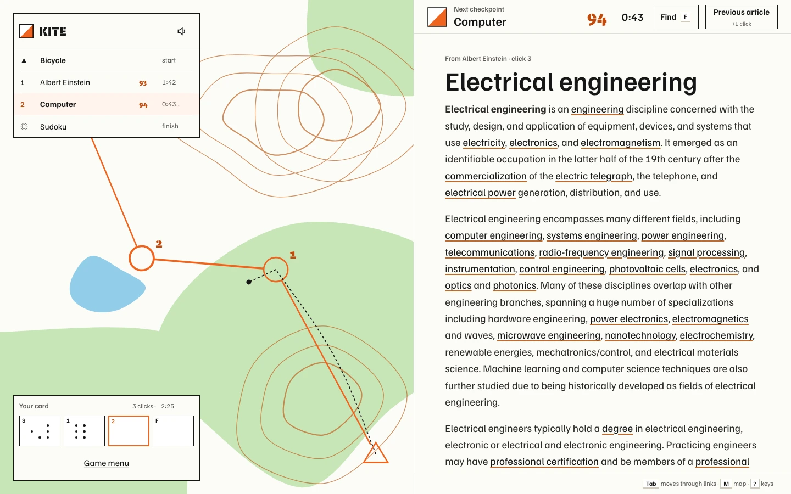
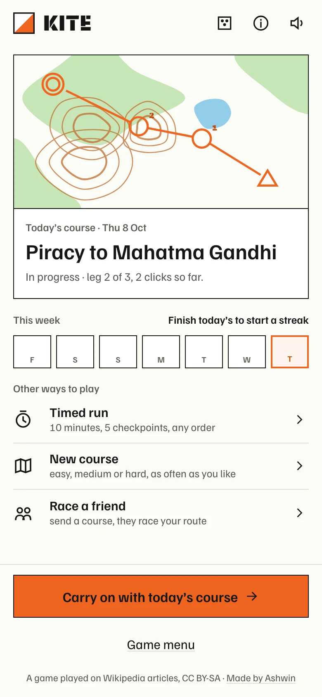
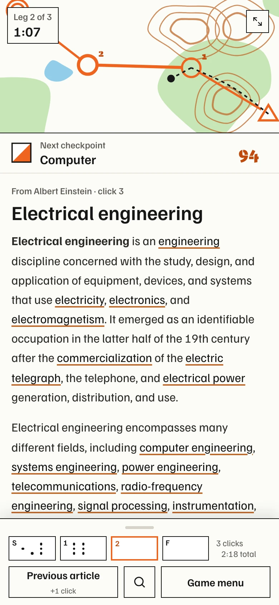
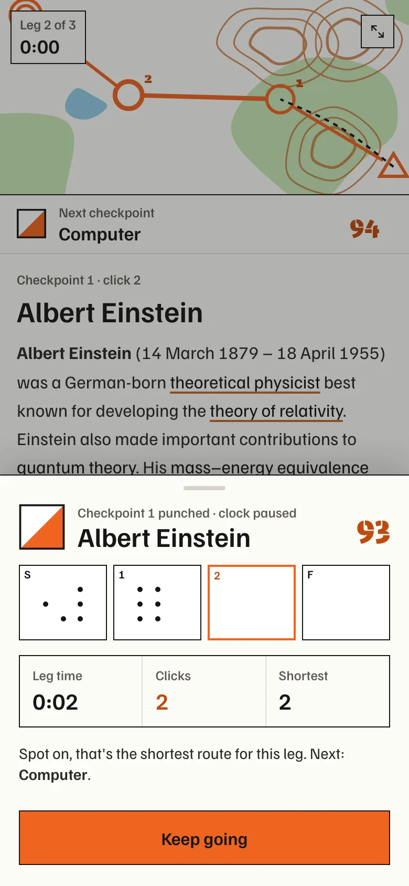
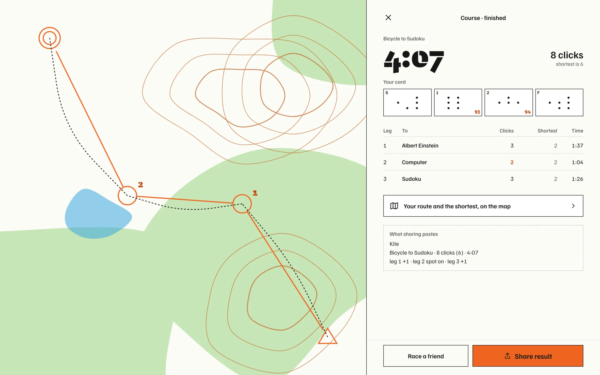
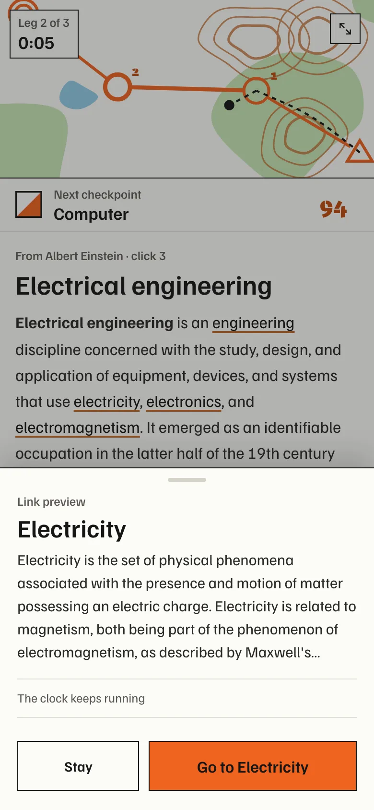
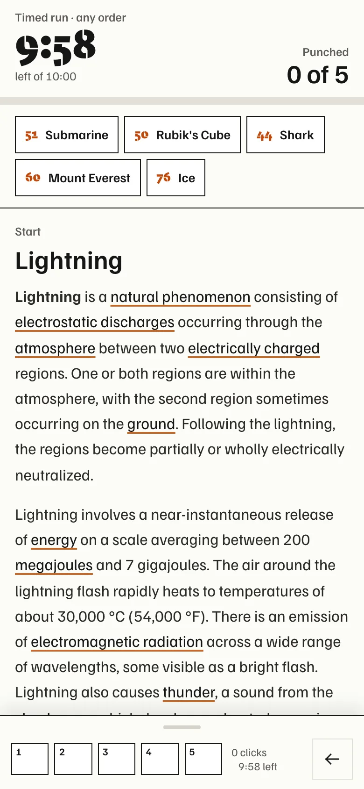
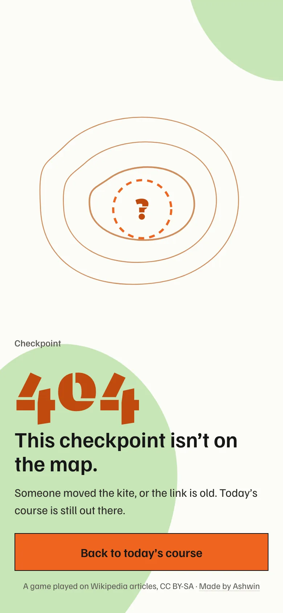

<p align="center">
  <a href="https://kite.ashwin.co.in">
    
  </a>
</p>

<p align="center">
  <a href="https://kite.ashwin.co.in"><strong>kite.ashwin.co.in</strong></a>
  &nbsp;·&nbsp;
  <a href="#how-the-courses-are-made">how the courses are made</a>
  &nbsp;·&nbsp;
  <a href="#the-design">the design</a>
  &nbsp;·&nbsp;
  <a href="#running-it">running it</a>
</p>

<br>

the source of **[kite.ashwin.co.in](https://kite.ashwin.co.in)**, a race through wikipedia. get from the start article to the finish through two checkpoints, using only the links inside each article. fewest clicks wins, the clock breaks ties.

it borrows from orienteering, where you run a course from checkpoint to checkpoint with a map and a card you punch at each one.

## what it does

<p align="center">
  
  &nbsp;
  
  &nbsp;
  
</p>

- **today's course.** everyone gets the same course each day: a start, two checkpoints and a finish. each one is a wikipedia article.
- **links only.** you move by tapping links inside the article. no search, no infobox, no see also. going back works and counts as a click.
- **your card.** every checkpoint punches its own pin pattern into your card, made from the article's title. the clock pauses while you read your leg time.
- **the shortest route.** every leg comes with the fewest clicks it can be done in. after you finish, you see your route beside it, leg by leg.
- **link preview.** long press a link, or hover it on a computer, to read its first line before you go. the clock keeps running.
- **find on page.** `F` filters the links on the page by a word, like ctrl+F in a real wikirace.
- **timed run.** ten minutes, five checkpoints, any order. get as many as you can.
- **new course.** easy, medium or hard, as often as you like.
- **race a friend.** your card goes out as a link. they get the same course, with your clicks and leg times to beat.
- **streak and history.** a week of punched boxes on the home screen, and every finished card kept on your device.
- **share.** the result pastes as three short lines, like a daily puzzle.

### keys

| key | does |
| --- | --- |
| `Tab`, `Enter` | move through the links, go to one |
| `F` | find a link on this page |
| `⌫` | back one article, adds a click |
| `M` | open the map |
| `S` | sound on or off |
| `?` | all the keys |
| `Esc` | close |

## how the courses are made

a course is only fair if the shortest route is real. `scripts/courses.ts` builds them ahead of time and writes `src/data/courses.json`.

- it picks articles from a pool of 180 that most people know (tea, black hole, chennai, ada lovelace, origami).
- for each leg it works out the true shortest number of clicks, using the same rules the game uses for which links count. both sides share `src/lib/links.ts`, so a link the script counts is always a link you can tap.
- one click is checked straight from the article. two clicks are checked against wikipedia's link table for every link on the page, then confirmed on the real article. if neither works, it searches for a three click route. finding one proves the shortest is three.
- legs that need one click, or more than three, are thrown out. every course lands between 6 and 9 clicks: 6 is easy, 7 is medium, 8 or more is hard.
- requests go out at about three a second with a named user agent, and every page is cached, so a rerun only asks wikipedia for what it hasn't seen.

the day's course is picked by date, so everyone gets the same one with no server.

## how a click works

- articles come from wikipedia's page html api, called from your browser with an `Api-User-Agent` header. a browser gets 200 requests a minute and a round uses about one per click.
- the article is cleaned of navboxes, infoboxes, references, hatnotes, images and the end sections, then sanitised with dompurify. what's left is the text and its links.
- a checkpoint counts when the article you land on is the checkpoint, after redirects. `Tea plant` takes you to `Camellia sinensis`, and that's what is checked.
- the old article stays on screen while the next one loads, with a thin orange line if it takes a moment.
- the browser's back button is the game's back button. it steps back one article and adds a click, and at the start of a leg it asks if you want to leave.

## the design

the page is an orienteering map and a control card.

- **the map.** paper white, forest green, brown contours and blue water, drawn fresh for each course from its id. the course is printed on top in orange: a triangle for the start, circles for checkpoints, a double circle for the finish. your route is a dashed black line.
- **one orange.** kite orange is the course: the checkpoints, the legs, the box you're about to punch and the main button. real orienteering maps print the course in purple. it moved to the kite's orange here.
- **the card.** square boxes with a corner number. a checkpoint punches pins into its box, a different pattern for every article.
- **plain words.** the app says checkpoint, leg time, your card and timed run. control, split, mispunch and score-o stay in this readme.
- **type.** familjen grotesk for everything you read, bespoke stencil for the wordmark, checkpoint codes and big times, like the code stencilled on a real control stand.
- **sound.** synthesized in the browser: a footstep for each click, the beep of an electronic punch at a checkpoint, a long beep at the finish, a paper rustle when a sheet opens. it respects the iphone silent switch and goes quiet in a background tab.
- **no dark mode.** it's a paper map, read in daylight.
- **on a phone** the map is a strip at the top and your card is a sheet you pull up from the bottom. landscape phones put the map on the left. tablets add the course list beside the article. desktops give the map half the screen.
- **nothing jumps.** layout shift measures 0 on load and through a whole course.

<details>
<summary><strong>more screenshots</strong></summary>

<br>









</details>

## the stack

| layer | choices |
| --- | --- |
| app | react 19, typescript 7, vite 8 |
| style | tailwind 4, hand drawn svg icons |
| data | wikipedia page html and summary apis, called from the browser |
| safety | dompurify on every article |
| courses | `scripts/courses.ts` with linkedom, run ahead of time |
| storage | localStorage for runs, cards, streak and sound |
| offline | a service worker for the shell |
| hosting | vercel |
| tooling | biome, node's test runner |

## running it

```bash
npm install
npm run dev
```

node 24. `npm run dev` and `npm run build` fetch bespoke stencil from fontshare first, because its licence allows self-hosting but not putting the font in a public repo. it lands in `public/fonts/stencil/`, which git ignores. without a connection the stencil text falls back to a system font.

to add more courses:

```bash
KITE_DAYS=90 npm run courses
```

it keeps the courses already in `src/data/courses.json` and adds new ones until there are `KITE_DAYS`. set `KITE_CACHE` to keep its page cache somewhere other than `.course-cache`.

```bash
npm run check     # biome
npm run typecheck
npm test          # the link rules
```

## the shape of it

```
scripts/
  courses.ts        builds courses and their shortest routes
  fonts.mjs         fetches bespoke stencil at build time
src/
  data/             courses.json, pool.json
  lib/
    links.ts        which links count, shared by the app and the script
    wiki.ts         fetching and cleaning articles
    run.ts          the clock, clicks, punches, results, streak
    course.ts       today's course, levels, timed sets, codes, pins
    sound.ts        synthesized sounds
  components/       map, card, reader, sheet, drawer
  screens/          home, briefing, run, card, 404
```

## credits

- articles from [wikipedia](https://en.wikipedia.org), under [cc by-sa 4.0](https://creativecommons.org/licenses/by-sa/4.0/), restyled for the game. kite isn't made by or connected to the wikimedia foundation.
- [familjen grotesk](https://github.com/Familjen-Sthlm/Familjen-Grotesk) by familjen sthlm, under the sil open font license.
- [bespoke stencil](https://www.fontshare.com/fonts/bespoke-stencil) by indian type foundry, under the itf free font license.

## known rough edges

- the shortest routes were worked out from the articles when the course was made. articles change, so a leg can end up shorter, or rarely longer, than it says.
- `courses.json` holds 60 courses. after that the daily course goes round again from the start until the script is run for more.
- there's no shared leaderboard. results stay on your device, and race a friend works by link.
- live races in a room, like thewikigame, would need a realtime server, so they aren't here.
- a page with a lot of tables can be long to scroll on a phone. find on page helps.
